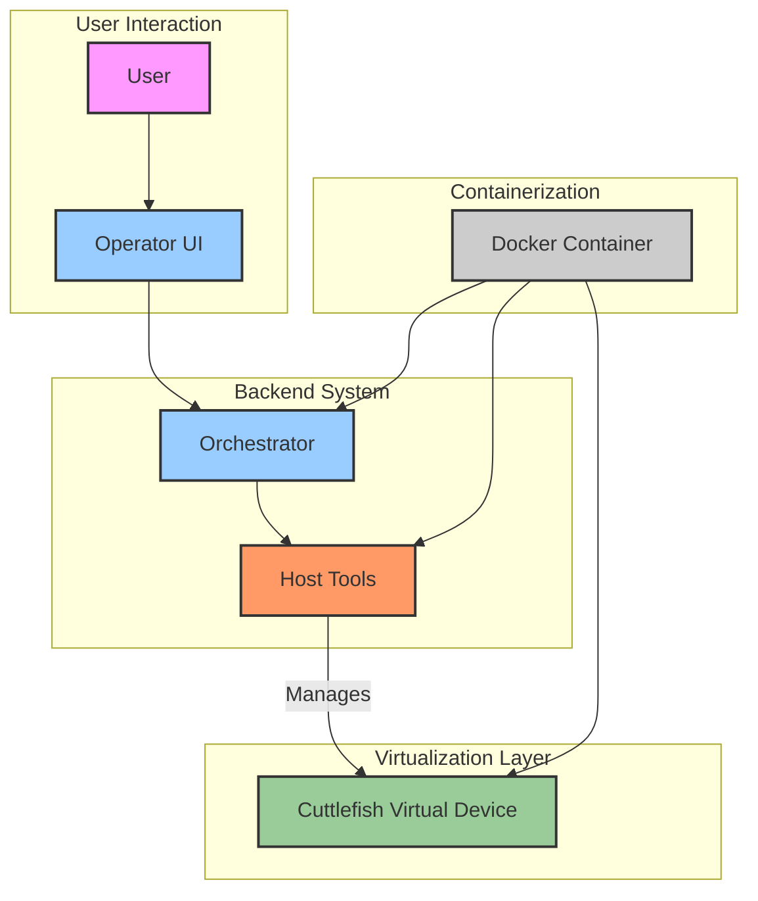

# Design Document

## 1. Overall Architecture

This section describes the main components of the Cuttlefish-Cloud project, their purpose, and their interactions.

The main components are:
- **Cuttlefish Virtual Device (cvd)**: This is the core Android virtual device. It runs Android OS and applications.
- **Host Tools**: These are command-line tools running on the host machine (or within the Docker container) that manage the lifecycle of cvd instances (e.g., launching, stopping, listing).
- **Frontend**: This consists of user-facing and backend components:
    - **Operator UI**: A user interface (likely web-based) for users to manage their Cuttlefish instances. This UI is served by the `operator` Go component.
    - **Orchestrator**: A backend service (the `host_orchestrator` Go component) that handles requests, manages resources, and interacts with host tools to control cvd instances. The Operator UI, through the `operator` Go component, communicates with the Orchestrator.
- **Docker Containerization**: Cuttlefish and its dependencies are packaged within Docker containers for portability and isolation.

### Component Interactions

1.  The **User** interacts with the **Operator UI**.
2.  The **Operator UI** (via the `operator` Go component) sends requests to the **Orchestrator** (`host_orchestrator` Go component).
3.  The **Orchestrator** uses **Host Tools** to manage **Cuttlefish Virtual Device (cvd)** instances.
4.  All Cuttlefish-related components (cvd, host tools, and potentially parts of the orchestrator) run within **Docker Containers**.

### High-Level Diagram

## 2. Detailed Design

### 2.1. Base Directory Structure

The Cuttlefish-Cloud project is organized into several key directories within its base. This section details the purpose and contents of these directories.

#### 2.1.1. `cvd/` Subdirectory

The `cvd/` directory contains the core components related to the Cuttlefish virtual device itself. This includes:

*   **`allocd`**: A daemon responsible for managing the allocation and deallocation of Cuttlefish instances and their resources. It ensures that multiple instances do not conflict and resources are properly tracked.
*   **Android-specific code**: This encompasses the modifications and additions to the Android Open Source Project (AOSP) that enable it to run as a Cuttlefish virtual device. This might include kernel modifications, HAL implementations, and specific system services.
*   **Cuttlefish common/host libraries**: These are libraries shared across different parts of the Cuttlefish ecosystem.
    *   **Common libraries** provide functionalities used by both the device and host-side tools (e.g., logging, configuration parsing).
    *   **Host libraries** provide functionalities specifically for host-side tools that interact with the virtual device.
*   **gRPC/Protocol Buffers**: Communication between various Cuttlefish components (e.g., between host tools and `allocd`, or between the orchestrator and host tools) is often facilitated using gRPC. Protocol Buffers are used to define the structure of messages exchanged in these communications, ensuring a consistent and versionable API.

#### 2.1.2. `host/` Subdirectory

The `host/` directory contains tools and scripts primarily intended for deployment, management, and interaction with Cuttlefish instances from the host system (or the system managing the Docker containers). This includes:

*   Command-line utilities for launching, stopping, listing, and debugging Cuttlefish instances.
*   Scripts for setting up the host environment, installing dependencies, and configuring network interfaces.
*   Orchestration logic or hooks that might be used by higher-level management systems (like the proposed Orchestrator).

#### 2.1.3. `base/` Subdirectory and Debian Packages

The `base/` subdirectory is crucial for packaging the core Cuttlefish components into Debian packages. These packages simplify deployment and ensure that dependencies are correctly managed on Debian-based systems (like Ubuntu). The key packages built from this directory are:

*   **`cuttlefish-base`**: This package typically contains the fundamental files and dependencies required to run Cuttlefish. It might include common libraries, configuration files, and essential tools.
*   **`cuttlefish-integration`**: This package likely provides components and scripts for integrating Cuttlefish with the host system or other services. This could involve setting up users, permissions, network configurations, or system services necessary for Cuttlefish to operate smoothly.

These Debian packages are fundamental for creating reproducible Cuttlefish deployments, especially when setting up new host machines or building Docker images.

### 2.2. Frontend Directory Structure

The `frontend/` directory houses the components responsible for user interaction, orchestration of Cuttlefish instances, and overall management of the Cuttlefish-Cloud environment. These are primarily Go-based applications and libraries.

#### 2.2.1. Go-based Components

*   **`host_orchestrator`**: This is a key backend service. It runs on the host machine (or a designated management node) and is responsible for:
    *   Managing the lifecycle of Cuttlefish instances (launching, stopping, monitoring).
    *   Allocating resources (e.g., device IDs, ports) to instances.
    *   Interacting with lower-level Cuttlefish tools (like those in `cvd/` and `host/`).
    *   Exposing an API (likely gRPC or REST) for the `operator` or other management tools to consume.

*   **`liboperator`**: This is a Go library that provides a client-side interface to the `host_orchestrator`'s API. It encapsulates the communication logic (e.g., gRPC client stubs, request/response handling) and allows other Go applications, like the `operator`, to interact with the `host_orchestrator` programmatically. This promotes code reuse and a clear separation of concerns.

*   **`operator`**: This component serves as the user-facing part of the frontend. It typically includes:
    *   A web server that hosts the user interface.
    *   Backend logic (using `liboperator`) to handle user requests from the UI, translate them into actions for the `host_orchestrator`, and display results.
    *   User authentication and authorization mechanisms.

#### 2.2.2. Client-Server Architecture and Web UI

The frontend components form a client-server architecture:

*   **Server-side**: The `host_orchestrator` acts as the primary server, managing the core Cuttlefish operations. The `operator` also has a server component that serves the web UI and handles API requests from the client.
*   **Client-side**:
    *   `liboperator` acts as a client library for the `host_orchestrator`.
    *   The **Web UI** is the client that users interact with. It's a web application (likely built with HTML, CSS, and JavaScript) that runs in the user's browser. It communicates with the `operator`'s backend (e.g., via REST APIs or WebSockets) to send commands and display information about Cuttlefish instances.

This architecture allows users to manage Cuttlefish instances remotely through a web browser without needing direct access to the host machines running the virtual devices.

#### 2.2.3. Debian Packages from `frontend/`

The `frontend/` directory is also used to build Debian packages, which simplify the deployment and management of the frontend services:

*   **`cuttlefish-orchestration`**: This package likely bundles the `host_orchestrator` service and its dependencies. Installing this package would set up the orchestration service on a host, configure it to run (e.g., as a systemd service), and ensure all necessary components are in place.
*   **`cuttlefish-user`**: This package probably contains the `operator` application (including its web server and UI assets) and `liboperator`. Installing this package would deploy the user-facing web interface, allowing users to connect to and manage the Cuttlefish environment.

These packages ensure that the frontend components are installed consistently and can be easily updated or removed.

### 2.3. Docker Directory Structure (`docker/`)

The `docker/` directory is central to the containerization strategy of Cuttlefish-Cloud. It contains Dockerfiles, scripts, and configuration files necessary to build and run Cuttlefish virtual devices and associated services within Docker containers. Containerization provides portability, isolation, and reproducible environments.

Key contents and purpose include:

*   **Dockerfiles**:
    *   Multiple Dockerfiles are likely present, tailored for different purposes. For instance, there might be a base Cuttlefish image, an image for the `host_orchestrator`, and potentially images for specific Cuttlefish configurations or development environments.
    *   These Dockerfiles define the environment, install necessary dependencies (including the Debian packages like `cuttlefish-base`, `cuttlefish-integration`, `cuttlefish-orchestration`, `cuttlefish-user`), set up user accounts, and configure entry points for running Cuttlefish services.

*   **Build Scripts**:
    *   Scripts (e.g., shell scripts) that automate the process of building Docker images using the Dockerfiles. These scripts might handle tagging, layering, and optimizing the images.

*   **Runtime Scripts/Configuration**:
    *   Scripts or configuration files (e.g., `docker-compose.yml`) to simplify running Cuttlefish containers. These might define network configurations, volume mounts for persistent data (like Android images or instance-specific data), and environment variables.
    *   They manage the complexities of running Cuttlefish, which requires privileged access for KVM and specific kernel modules, and careful network setup to allow ADB connections and web access to the device.

*   **`docker/README.md`**:
    *   This file provides detailed, specific instructions on how to build the Docker images, run containers, configure them, and troubleshoot common issues. It is the primary source of truth for Docker-related operations. Users and developers should refer to this README for practical guidance.

The use of Docker allows Cuttlefish-Cloud to be deployed across different host environments with greater ease and consistency, abstracting away many of an underlying system's specific configurations.

## 3. Build Process

This section outlines the primary build processes for creating the necessary artifacts for Cuttlefish-Cloud, including Debian packages and Google Compute Engine (GCE) virtual machine images.

### 3.1. Building Debian Packages

The core Cuttlefish components and frontend services are packaged into Debian (`.deb`) files for easy distribution and installation on Debian-based systems like Ubuntu. As detailed in previous sections, these packages include:
- `cuttlefish-base`
- `cuttlefish-integration`
- `cuttlefish-orchestration`
- `cuttlefish-user`

The build process for these packages typically involves the following steps, executed from the root of the Cuttlefish-Cloud repository:

1.  **Prerequisites**: Ensure all build dependencies are installed. This usually includes tools like `debuild`, `dpkg-dev`, `golang`, and specific libraries required by Cuttlefish.
2.  **Navigate to Package Directory**: Change to the directory containing the Debian packaging files (e.g., `base/`, `frontend/`). These directories typically contain a `debian/` subdirectory with files like `control`, `rules`, `changelog`, etc.
3.  **Build Command**: Execute a command to build the package. A common command is `debuild -us -uc -b`, which builds the binary package (`-b`) without signing the source (`-us`) or changelog (`-uc`).
    *   For Go-based projects like those in `frontend/`, the `debian/rules` file will typically invoke Go build tools to compile the binaries before packaging them.
4.  **Output**: The generated `.deb` files will be placed in the parent directory of the build context (e.g., if building in `base/`, the `.deb` files appear in the repository root or a designated output directory).

These Debian packages are then used as dependencies for building Docker images (as described in Section 2.3) or for direct installation on host machines.

### 3.2. Building GCE Virtual Machine Images

For deployments on Google Cloud Platform (GCP), Cuttlefish-Cloud often utilizes custom Google Compute Engine (GCE) virtual machine (VM) images. These images are pre-configured with:
- A compatible Linux operating system (e.g., Ubuntu).
- All necessary Cuttlefish Debian packages pre-installed.
- Docker and its dependencies.
- Kernel modules required for Cuttlefish (e.g., KVM).
- Any other required host configurations or tools.

The process for building these GCE images is typically automated using tools like [Packer](https://www.packer.io/) or custom shell scripts that leverage `gcloud compute images create`. The general steps include:
1.  Starting with a base GCE image (e.g., a standard Ubuntu LTS image).
2.  Booting a temporary VM from this base image.
3.  Using a provisioning script (e.g., shell script, Ansible playbook) on the temporary VM to:
    *   Add package repositories if necessary.
    *   Install the Cuttlefish Debian packages (either by fetching them from a repository or copying them directly).
    *   Install Docker and other dependencies.
    *   Perform necessary system configurations (e.g., loading kernel modules, setting up user accounts).
4.  Stopping the temporary VM.
5.  Creating a new GCE custom image from the disk of the configured temporary VM.

This custom GCE image can then be used to quickly launch new VM instances that are ready to run Cuttlefish-Cloud services with minimal additional setup. The specific scripts and configurations for this process are typically maintained within the Cuttlefish-Cloud repository, possibly in a dedicated `gce/` or `images/` directory.

## 4. Contributing

This design document provides a high-level overview of the Cuttlefish-Cloud architecture and its components. For guidelines on how to contribute to the Cuttlefish-Cloud project, including code style, testing procedures, and the pull request process, please refer to the [CONTRIBUTING.md](CONTRIBUTING.md) file in the root of the repository.

All contributions should align with the overall architecture and design principles outlined in this document. If you plan to make significant changes or introduce new components, it is recommended to discuss these changes with the maintainers, potentially by proposing an update to this design document first.

## 5. Data Model
## 6. API Design
## 7. Scalability and Performance
## 8. Security Considerations
## 9. Future Enhancements
